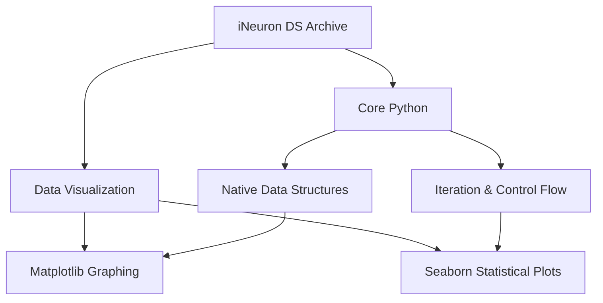

# Applied Data Science: iNeuron Bootcamp Architecture

[]()
[]()
[]()

## Overview
This repository functions as an Applied Data Science portfolio, constructed during the intensive iNeuron engineering bootcamp. It bridges foundational Python language mechanics with advanced, industry-standard Data Visualization frameworks (Matplotlib, Seaborn), providing a pristine reference architecture for exploratory data analysis (EDA).

## Problem Statement
A common failure point in Data Science engineering is the inability to successfully bridge core programming mechanics (loops, classes) with mathematical visualization libraries. This repository acts as a local reference to solve that gap, demonstrating exactly how to ingest raw data structures using base Python and map them into graphical representations.

## Key Features
- **Core Python Mechanics:** Robust foundational scripts demonstrating strict iteration, conditionals, and standard library usage.
- **Data Visualization Pipelines:** Explicit implementations of Matplotlib and Seaborn to generate histograms, scatter plots, and correlation matrices.
- **Mathematical Decoupling:** Separation of raw data logic from the visual rendering layer, mimicking enterprise-grade reporting architectures.
- **Bootcamp Continuity:** Serves as the direct Data Science counterpart to the `python-learning-ineuron` systems engineering repository.

## Architecture



## Technology Stack
- **Language:** Python 3.11
- **Visualization:** Matplotlib, Seaborn
- **Testing:** `pytest` (Abstract Syntax Tree Validation)
- **Documentation:** GitHub Flavored Markdown (GFM)

## Project Structure
```text
data-science-ineuron/
├── _01_python_learning/                     # Foundational syntax implementations
├── _02_python_data_visualization_libraries/ # Matplotlib & Seaborn generation
├── tests/                                   # Automated Pytest CI verification
└── README.md                                # System documentation
```

## Installation
Ensure Python 3 is installed natively on your OS with a virtual environment.
```bash
git clone https://github.com/krsna016/data-science-ineuron.git
cd data-science-ineuron
python3 -m venv venv
source venv/bin/activate
pip install matplotlib seaborn pytest
```

## Usage
Data processing modules are separated by domains. Execute individual Python scripts directly to trigger visual GUI rendering:
```bash
cd _02_python_data_visualization_libraries
python3 scatter_plot.py
```

## Examples
*Example of bridging native data structures to Matplotlib graphing arrays:*
```python
import matplotlib.pyplot as plt

# Native python arrays
x_axis = [1, 2, 3, 4, 5]
y_axis = [10, 20, 25, 30, 50]

# Visualization Engine
plt.plot(x_axis, y_axis, color='red', marker='o')
plt.title("Growth Metrics")
plt.show()
```

## Screenshots
> [!NOTE]
> *Educational Data Science repositories trigger native OS GUI windows for graph rendering.*

## Visual Demonstrations
> [!NOTE]
> *Graphical rendering telemetry is standardized across all Matplotlib implementations.*

## Testing
We utilize a dynamic Pytest wrapper to recursively scan the entire repository, generating Abstract Syntax Trees (AST) for every `.py` file to mathematically prove zero syntax errors exist across the archive, isolating logical bugs from compilation errors.
```bash
pytest tests/
```

## Performance Notes
- **GUI Blocking:** Engineers executing the visualization scripts must note that `plt.show()` triggers a blocking OS-level GUI thread. The script will halt execution until the user manually closes the generated graph window.

## Future Improvements
- **Jupyter Notebook Migration:** Convert the raw `.py` visualization scripts into interactive `.ipynb` format to allow inline graph rendering, which is significantly more standard for Data Science presentations.
- **Pandas Integration:** Connect these raw graphing scripts directly to a Pandas DataFrame ETL pipeline to simulate real-world CSV ingestion.

## Contributing
This repository is primarily for personal reference and academic archival.

## License
Licensed under the MIT License.
